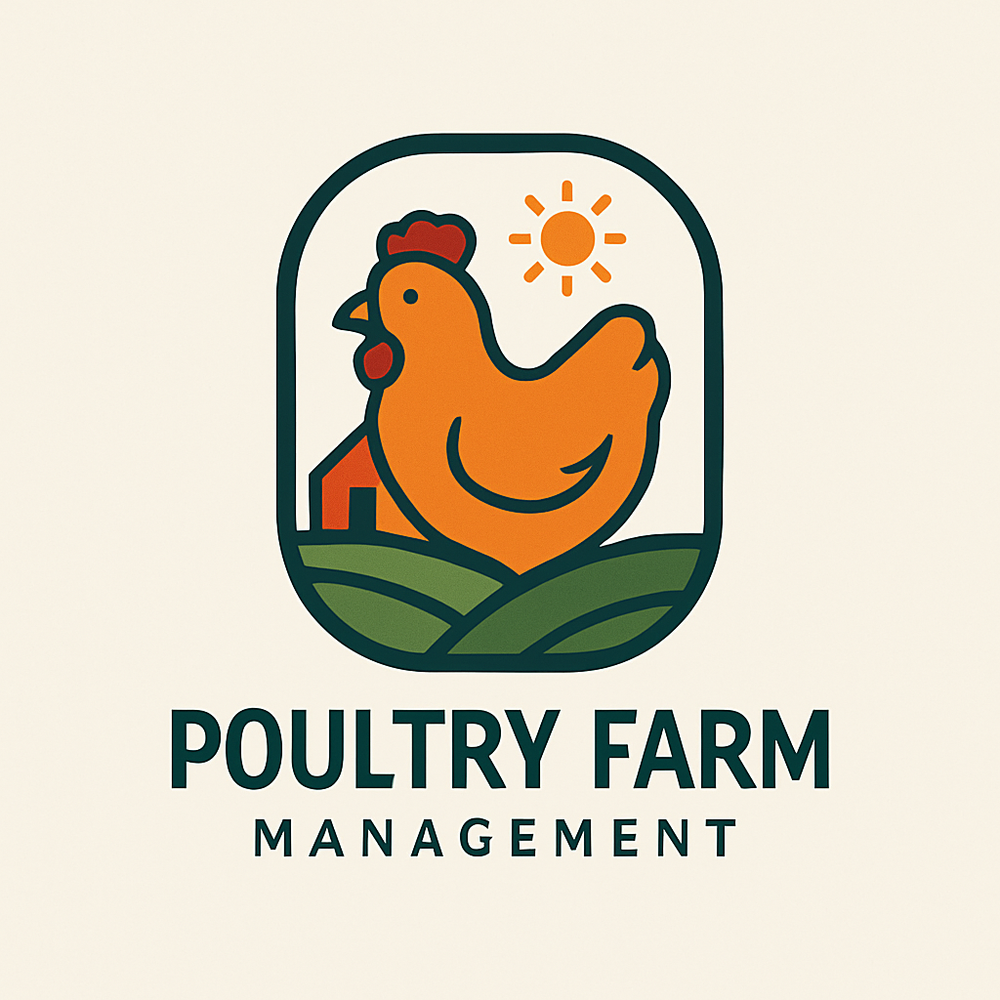

<div align="center">
  
  <h1>تطبيق إدارة مزرعة الدواجن</h1>
  <p>نظام متكامل لإدارة مزارع الدواجن اللاحم بكفاءة عالية</p>
</div>

<div dir="rtl">

## 🚀 نظرة عامة

تطبيق إدارة مزرعة الدواجن هو حل شامل مصمم خصيصًا لمربي الدواجن اللاحم. يوفر التطبيق واجهة سهلة الاستخدام لإدارة جميع جوانب تربية الدواجن، بدءًا من تسجيل القطعان وحتى متابعة المصاريف والإيرادات وإنشاء التقارير.

## ✨ المميزات الرئيسية

### 📊 إدارة القطعان
- تسجيل معلومات القطعان (الاسم، رقم الدفعة، نوع الطيور، العدد، تاريخ البدء)
- متابعة حالة القطيع (نشط، مكتمل)
- عرض قائمة بجميع القطعان مع إمكانية التصفية والبحث

### 📝 السجلات اليومية
- تسجيل معدلات النفوق اليومية
- تسجيل الوزن ومعدل استهلاك العلف
- إضافة ملاحظات يومية

### 🍲 سجلات التغذية
- تسجيل أنواع العلف المستخدمة
- متابعة كميات العلف وتكلفتها
- حساب معدل استهلاك العلف

### 💉 السجلات الصحية
- تسجيل التحصينات والأدوية
- متابعة الحالة الصحية للقطيع
- حساب تكاليف الرعاية الصحية

### 💰 إدارة المصاريف
- تسجيل جميع المصاريف المتعلقة بالقطيع
- تصنيف المصاريف حسب الفئة
- تحليل التكاليف الإجمالية

### ⏰ نظام التنبيهات
- إعداد تنبيهات للتحصينات والمهام المهمة
- تنبيهات بمواعيد الإجراءات الدورية
- تحديد أولويات التنبيهات (عالية، متوسطة، منخفضة)

### 📈 التقارير والتحليلات
- إنشاء تقارير مفصلة عن أداء القطيع
- تصدير البيانات إلى ملفات Excel
- تحليل الربحية والأداء

### 💾 النسخ الاحتياطي واستعادة البيانات
- إنشاء نسخ احتياطية من قاعدة البيانات
- استعادة البيانات من النسخ الاحتياطية
- مشاركة النسخ الاحتياطية

## 🛠️ التقنيات المستخدمة

- **Flutter**: إطار عمل لتطوير تطبيقات متعددة المنصات
- **Provider**: لإدارة حالة التطبيق
- **SQLite**: قاعدة بيانات محلية لتخزين البيانات
- **Excel**: لتصدير البيانات وإنشاء التقارير
- **Chart**: لعرض الرسوم البيانية والإحصائيات

## 📱 متطلبات النظام

- **نظام التشغيل**: Android 5.0+ أو iOS 11.0+
- **المساحة**: 50 ميجابايت من مساحة التخزين
- **الذاكرة**: 2 جيجابايت من ذاكرة الوصول العشوائي على الأقل

## 🔧 التثبيت

1. قم بتنزيل التطبيق من [Google Play](https://play.google.com/store) أو [App Store](https://www.apple.com/app-store/)
2. قم بتثبيت التطبيق على جهازك
3. افتح التطبيق وابدأ في استخدامه مباشرة

## 👨‍💻 للمطورين

### متطلبات التطوير

- Flutter SDK (الإصدار 3.5.4 أو أحدث)
- Dart SDK (الإصدار 3.5.4 أو أحدث)
- Android Studio / VS Code

### تثبيت وتشغيل المشروع

```bash
# استنساخ المشروع
git clone https://github.com/yourusername/broiler_poultry_farm_management_app.git

# الانتقال إلى مجلد المشروع
cd broiler_poultry_farm_management_app

# تثبيت التبعيات
flutter pub get

# تشغيل التطبيق في وضع التطوير
flutter run
```

## 📄 الترخيص

هذا المشروع مرخص بموجب [رخصة MIT](LICENSE).

## 🤝 المساهمة

نرحب بمساهماتكم! إذا كنت ترغب في المساهمة في هذا المشروع، يرجى اتباع الخطوات التالية:

1. قم بعمل Fork للمشروع
2. قم بإنشاء فرع جديد للميزة التي تريد إضافتها (`git checkout -b feature/amazing-feature`)
3. قم بإجراء التغييرات اللازمة وإضافتها (`git add .`)
4. قم بعمل Commit للتغييرات (`git commit -m 'إضافة ميزة رائعة'`)
5. قم بدفع التغييرات إلى الفرع الخاص بك (`git push origin feature/amazing-feature`)
6. قم بفتح طلب سحب (Pull Request)

## 📞 الدعم والتواصل

إذا كان لديك أي استفسارات أو مشاكل، يرجى فتح [issue](https://github.com/yourusername/broiler_poultry_farm_management_app/issues) أو التواصل معنا عبر البريد الإلكتروني: support@example.com

---

<p align="center">صنع بـ ❤️ لمربي الدواجن</p>

</div>
